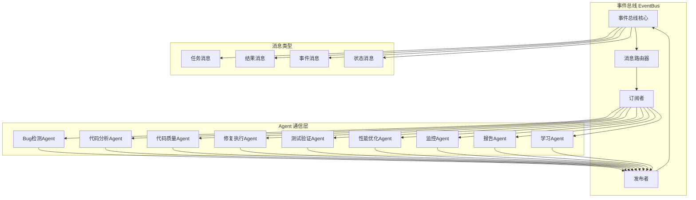
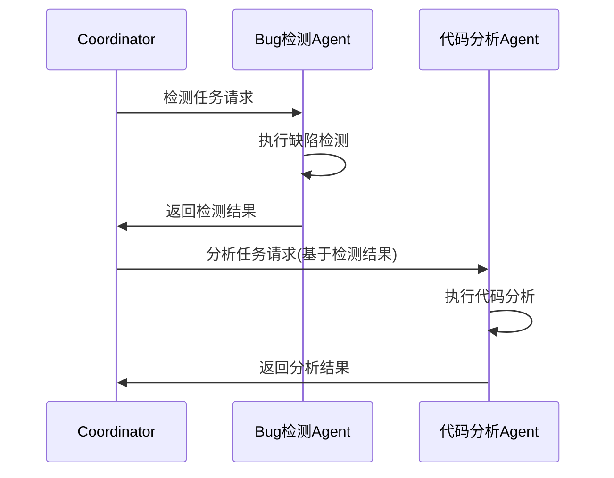
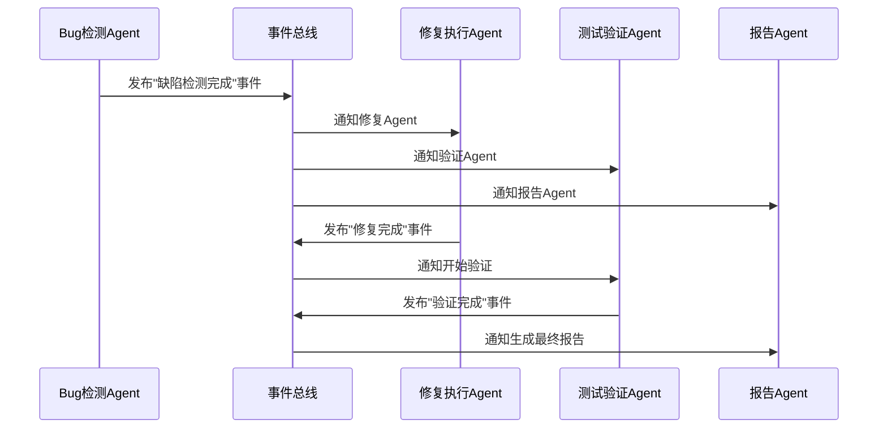
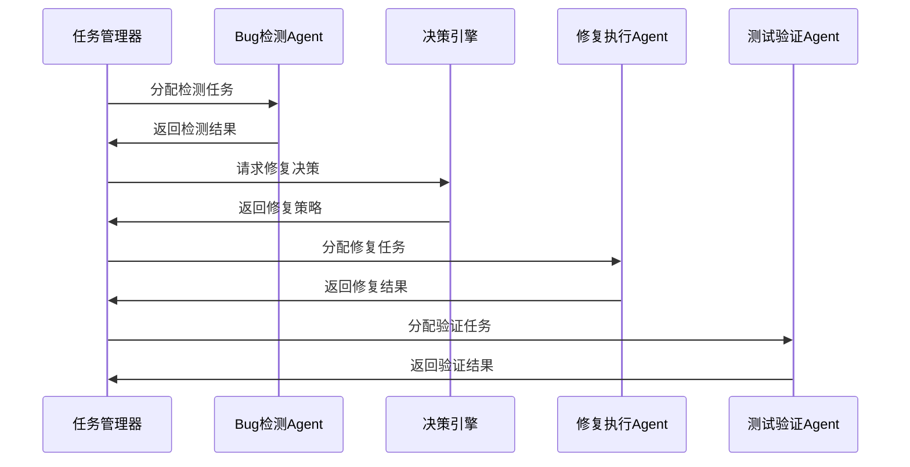
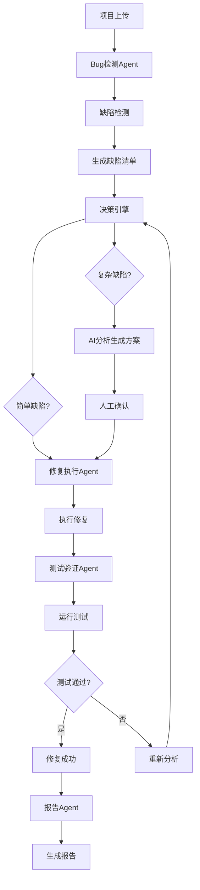
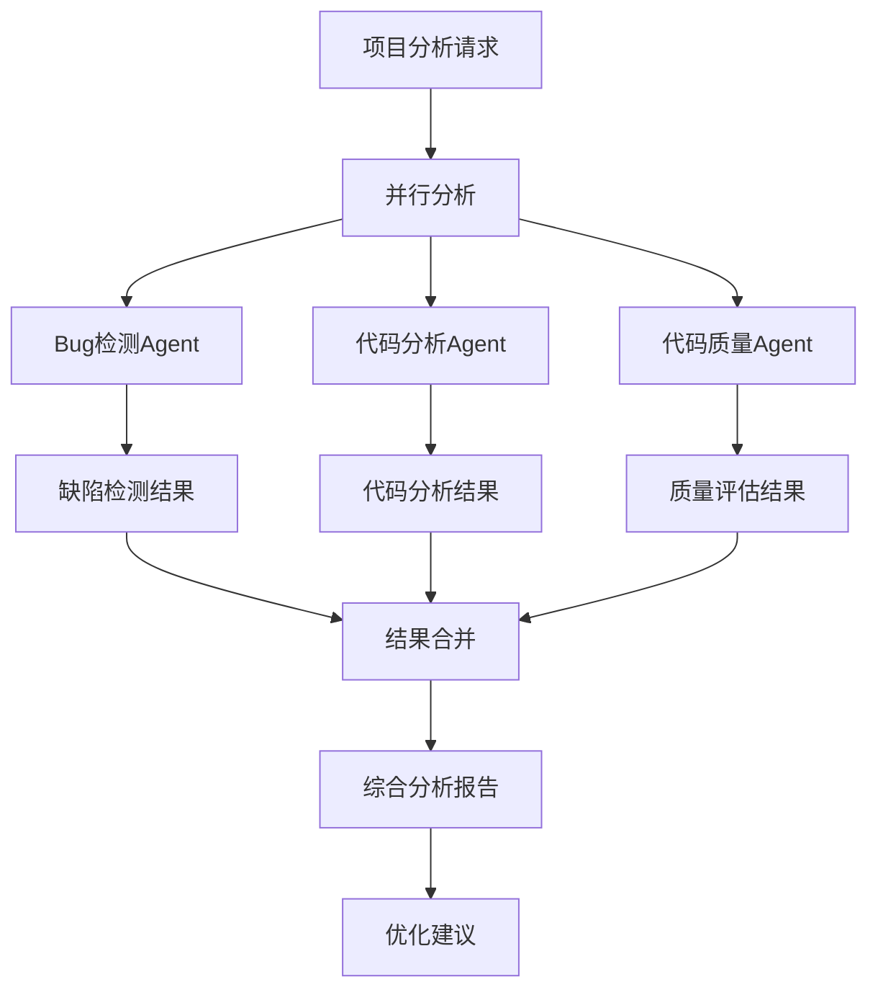
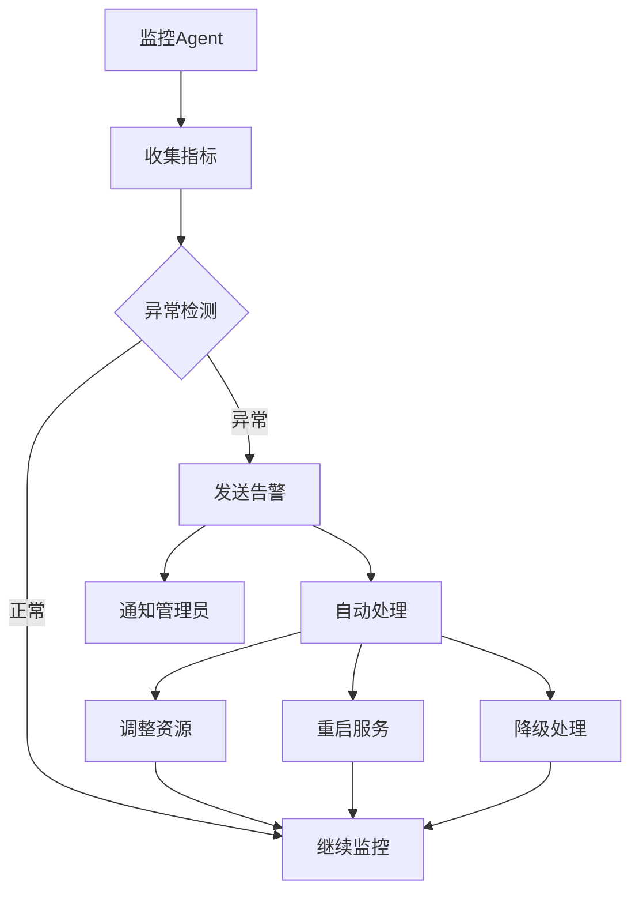

# Agent 交互机制设计

## Agent 通信架构



## 消息类型定义

### 1. 任务消息 (TaskMessage)
```python
class TaskMessage:
    task_id: str
    task_type: str
    source_agent: str
    target_agent: str
    payload: Dict[str, Any]
    priority: int
    timestamp: datetime
    timeout: int
```

### 2. 结果消息 (ResultMessage)
```python
class ResultMessage:
    task_id: str
    source_agent: str
    target_agent: str
    result: Dict[str, Any]
    status: str  # success, failed, partial
    error: Optional[str]
    timestamp: datetime
```

### 3. 事件消息 (EventMessage)
```python
class EventMessage:
    event_type: str
    source_agent: str
    payload: Dict[str, Any]
    timestamp: datetime
    broadcast: bool  # 是否广播给所有Agent
```

### 4. 状态消息 (StatusMessage)
```python
class StatusMessage:
    agent_id: str
    status: str  # running, idle, error, busy
    metrics: Dict[str, Any]
    timestamp: datetime
```

## Agent 交互模式

### 1. 请求-响应模式


### 2. 发布-订阅模式


### 3. 工作流模式


## 具体交互场景

### 场景1: 完整缺陷修复流程


### 场景2: 多Agent协作分析


### 场景3: 实时监控与反馈


## 通信协议设计

### 1. 消息格式
```json
{
    "message_id": "uuid",
    "message_type": "task|result|event|status",
    "source_agent": "agent_id",
    "target_agent": "agent_id|broadcast",
    "timestamp": "2024-01-01T00:00:00Z",
    "payload": {
        "task_type": "detect_bugs",
        "data": {...},
        "metadata": {...}
    },
    "priority": 1,
    "timeout": 300,
    "retry_count": 0
}
```

### 2. 错误处理
```python
class CommunicationError(Exception):
    def __init__(self, message: str, error_code: str, retry_after: int = None):
        self.message = message
        self.error_code = error_code
        self.retry_after = retry_after

class AgentUnavailableError(CommunicationError):
    pass

class MessageTimeoutError(CommunicationError):
    pass

class InvalidMessageError(CommunicationError):
    pass
```

### 3. 重试机制
```python
class RetryPolicy:
    max_retries: int = 3
    base_delay: float = 1.0
    max_delay: float = 60.0
    exponential_backoff: bool = True
    
    def calculate_delay(self, attempt: int) -> float:
        if self.exponential_backoff:
            delay = self.base_delay * (2 ** attempt)
            return min(delay, self.max_delay)
        return self.base_delay
```

## 性能优化策略

### 1. 消息批处理
- 将多个小消息合并为批量消息
- 减少网络开销和序列化成本
- 提高吞吐量

### 2. 异步处理
- 所有Agent通信都是异步的
- 使用消息队列避免阻塞
- 支持并发处理多个任务

### 3. 缓存机制
- 缓存频繁访问的数据
- 减少重复计算
- 提高响应速度

### 4. 负载均衡
- 根据Agent负载动态分配任务
- 支持Agent集群部署
- 自动故障转移

## 安全考虑

### 1. 消息加密
- 敏感数据加密传输
- 使用TLS/SSL协议
- 消息签名验证

### 2. 访问控制
- Agent身份认证
- 权限管理
- 操作审计

### 3. 数据隔离
- 不同项目数据隔离
- 敏感信息脱敏
- 数据访问日志
