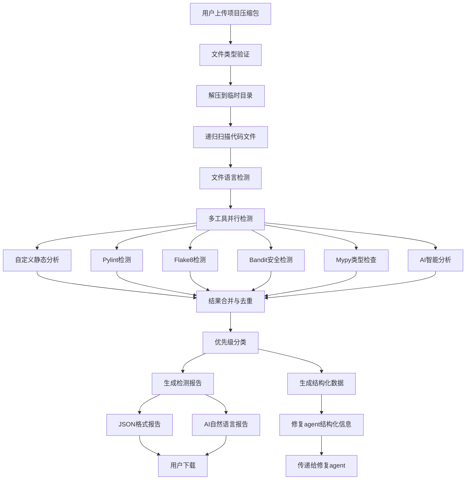

# Bug Detection Agent 详细说明文档

## 1. 系统概述

Bug Detection Agent 是一个智能缺陷检测系统，能够上传复杂项目压缩包，对其中代码文件进行静态缺陷分析，按优先级返回缺陷清单，并生成结构化信息给修复agent。

## 2. 核心功能特性

### 2.1 多语言支持
- **Python**: 支持 .py, .pyw, .pyi 文件
- **Java**: 支持 .java 文件  
- **C/C++**: 支持 .c, .cpp, .h, .hpp 文件
- **JavaScript/TypeScript**: 支持 .js, .jsx, .ts, .tsx 文件
- **Go**: 支持 .go 文件

### 2.2 项目压缩包处理
- 支持多种压缩格式：ZIP, TAR, TAR.GZ, RAR, 7Z
- 自动解压到临时目录
- 递归扫描项目中的所有代码文件
- 文件大小限制：单文件10MB，项目100MB

### 2.3 多维度检测工具
- **自定义静态分析器**: 基于规则的内容分析
- **Pylint**: Python代码质量检查
- **Flake8**: Python代码风格检查
- **Bandit**: Python安全漏洞检测
- **Mypy**: Python类型检查
- **AI分析器**: 使用DeepSeek API进行智能分析

## 3. 关键代码逻辑详解

### 3.1 项目上传与解压流程

```python
async def extract_project(self, file_path: str) -> str:
    """解压项目文件"""
    try:
        file_path = Path(file_path)
        extract_dir = Path("temp_extract") / f"project_{datetime.now().strftime('%Y%m%d_%H%M%S')}"
        extract_dir.mkdir(parents=True, exist_ok=True)
        
        if file_path.suffix.lower() == '.zip':
            with zipfile.ZipFile(file_path, 'r') as zip_ref:
                zip_ref.extractall(extract_dir)
        elif file_path.suffix.lower() in ['.tar', '.tar.gz']:
            with tarfile.open(file_path, 'r:*') as tar_ref:
                tar_ref.extractall(extract_dir)
        else:
            # 如果是目录，直接复制
            shutil.copytree(file_path, extract_dir)
        
        return str(extract_dir)
```

**逻辑说明**：
1. 根据当前时间戳创建唯一的解压目录
2. 根据文件扩展名选择相应的解压方法
3. 支持ZIP、TAR、TAR.GZ等主流压缩格式
4. 如果是目录则直接复制，避免重复解压

### 3.2 文件语言检测机制

```python
def detect_language(self, file_path: str) -> str:
    """检测文件编程语言"""
    try:
        file_path = Path(file_path)
        extension = file_path.suffix.lower()
        
        # 根据文件扩展名检测语言
        for language, config in self.supported_languages.items():
            if extension in config["extensions"]:
                return language
        
        # 如果无法通过扩展名检测，尝试读取文件内容
        try:
            with open(file_path, 'r', encoding='utf-8', errors='ignore') as f:
                content = f.read(1024)  # 只读取前1KB
                
                # 基于文件内容的启发式检测
                if "package " in content and "import " in content:
                    return "java"
                elif "#include" in content and ("int main" in content or "void main" in content):
                    return "c"
                elif "#include" in content and ("std::" in content or "using namespace" in content):
                    return "cpp"
                elif "def " in content or "import " in content or "from " in content:
                    return "python"
                elif "function " in content or "var " in content or "let " in content:
                    return "javascript"
                elif "package " in content and "func " in content:
                    return "go"
        except:
            pass
        
        return "unknown"
```

**逻辑说明**：
1. 首先通过文件扩展名进行快速检测
2. 如果扩展名检测失败，读取文件前1KB内容
3. 使用语言特征关键词进行启发式检测
4. 支持多种编程语言的特征识别

### 3.3 多工具并行检测机制

```python
async def _detect_file_bugs(self, file_path: str, options: Dict[str, Any]) -> Dict[str, Any]:
    """检测单个文件的缺陷 - 支持多语言"""
    try:
        language = self.detect_language(file_path)
        all_issues = []
        detection_tools = []
        analysis_time = 0
        
        # 根据语言选择检测工具
        if language == "python":
            # Python文件检测
            if options.get("enable_static", True):
                start_time = datetime.now()
                issues = await self._analyze_file_content(file_path, content, language, options)
                end_time = datetime.now()
                all_issues.extend(issues)
                detection_tools.append("custom_analyzer")
                analysis_time += (end_time - start_time).total_seconds()
            
            # Pylint检测
            if options.get("enable_pylint", True) and self.pylint_tool:
                start_time = datetime.now()
                pylint_result = await self.pylint_tool.analyze(file_path)
                end_time = datetime.now()
                if pylint_result["success"]:
                    all_issues.extend(pylint_result["issues"])
                    detection_tools.append("pylint")
                analysis_time += (end_time - start_time).total_seconds()
            
            # 其他工具类似...
```

**逻辑说明**：
1. 根据文件语言类型选择相应的检测工具
2. 支持多种检测工具并行运行
3. 记录每个工具的检测时间和结果
4. 合并所有工具的检测结果

### 3.4 自定义静态分析规则

```python
async def _analyze_python_content(self, file_path: str, content: str, lines: List[str], filename: str, options: Dict[str, Any]) -> List[Dict[str, Any]]:
    """分析Python文件内容"""
    issues = []
    
    # 检测硬编码密钥
    for i, line in enumerate(lines, 1):
        if 'API_KEY' in line or 'SECRET' in line or 'PASSWORD' in line:
            issues.append({
                "type": "hardcoded_secrets",
                "severity": "error",
                "message": "发现硬编码的密钥或密码",
                "line": i,
                "file": filename,
                "language": "python"
            })
        
        # 检测不安全的eval使用
        if 'eval(' in line:
            issues.append({
                "type": "unsafe_eval",
                "severity": "error",
                "message": "不安全的eval使用",
                "line": i,
                "file": filename,
                "language": "python"
            })
        
        # 检测除零风险
        if '/' in line and ('/' in line.split('=')[-1] if '=' in line else True):
            if 'if' not in line and 'for' not in line and 'while' not in line:
                issues.append({
                    "type": "division_by_zero_risk",
                    "severity": "warning",
                    "message": "可能存在除零风险",
                    "line": i,
                    "file": filename,
                    "language": "python"
                })
```

**逻辑说明**：
1. 逐行分析代码内容
2. 使用正则表达式和关键词匹配检测特定问题
3. 根据问题严重性设置不同的优先级
4. 提供详细的错误位置和描述信息

### 3.5 AI智能分析

```python
async def _ai_analyze_file(self, file_path: str, language: str) -> List[Dict[str, Any]]:
    """使用AI分析非Python文件"""
    try:
        # 读取文件内容
        with open(file_path, 'r', encoding='utf-8', errors='ignore') as f:
            content = f.read()
        
        # 限制文件大小
        if len(content) > 50000:  # 50KB
            content = content[:50000] + "\n... (文件过大，已截断)"
        
        # 构建AI分析提示词
        prompt = f"""
请分析以下{language}代码文件，检测潜在的缺陷和问题：

文件路径: {file_path}
文件内容:
```
{content}
```

请检测以下类型的缺陷：
1. 语法错误和编译问题
2. 逻辑错误和算法问题
3. 内存泄漏和资源管理问题
4. 安全漏洞和输入验证问题
5. 性能问题和优化建议
6. 代码规范和最佳实践问题
```

**逻辑说明**：
1. 对非Python文件使用AI进行智能分析
2. 限制文件大小避免API超时
3. 构建专业的分析提示词
4. 解析AI返回的JSON格式结果

### 3.6 优先级分类与结构化输出

```python
def categorize_issues_by_priority(issues):
    """按优先级分类问题"""
    priority_categories = {
        "critical": [],  # 错误级别，安全相关
        "high": [],      # 错误级别，非安全相关
        "medium": [],    # 警告级别
        "low": []        # 信息级别
    }
    
    for issue in issues:
        severity = issue.get("severity", "info")
        issue_type = issue.get("type", "")
        
        # 安全相关问题优先级最高
        if severity == "error" and any(keyword in issue_type.lower() for keyword in 
                                      ["security", "vulnerability", "injection", "xss", "csrf", "secret", "password"]):
            priority_categories["critical"].append(issue)
        elif severity == "error":
            priority_categories["high"].append(issue)
        elif severity == "warning":
            priority_categories["medium"].append(issue)
        else:
            priority_categories["low"].append(issue)
    
    return priority_categories
```

**逻辑说明**：
1. 根据问题严重性和类型进行优先级分类
2. 安全相关问题优先级最高
3. 错误级别问题优先于警告级别
4. 为修复agent提供结构化的优先级信息

## 4. 系统架构流程图



## 5. 核心检测规则详解

### 5.1 安全检测规则
- **硬编码密钥检测**: 识别API_KEY、SECRET、PASSWORD等敏感信息
- **不安全的eval使用**: 检测可能导致代码注入的eval()调用
- **XSS漏洞检测**: 识别innerHTML、document.write等危险操作
- **缓冲区溢出检测**: 检测strcpy、strcat等不安全函数

### 5.2 代码质量检测规则
- **未使用导入检测**: 识别导入但未使用的模块
- **长函数检测**: 检测超过50行的函数
- **魔法数字检测**: 识别硬编码的数字常量
- **异常处理检测**: 检测裸露的except语句

### 5.3 性能检测规则
- **内存泄漏检测**: 检测malloc后未free的情况
- **资源管理检测**: 检测文件操作未使用with语句
- **死代码检测**: 识别可能未被使用的代码段

## 6. 输出格式说明

### 6.1 检测报告格式
```json
{
  "report_info": {
    "generated_at": "2025-09-28T16:39:06.080148",
    "file_path": "uploads/test_python.py",
    "total_issues": 1,
    "summary": {
      "error_count": 1,
      "warning_count": 0,
      "info_count": 0
    },
    "detection_tools": ["custom_analyzer", "bandit", "mypy"]
  },
  "issues": [
    {
      "type": "syntax_error",
      "severity": "error",
      "message": "语法错误: source code string cannot contain null bytes",
      "line": 1,
      "file": "test_python.py",
      "language": "python",
      "column": 0,
      "code_snippet": [...],
      "detailed_description": "...",
      "fix_suggestions": [...]
    }
  ],
  "statistics": {
    "by_severity": {"error": 1},
    "by_type": {"syntax_error": 1},
    "by_category": {"其他": 1}
  }
}
```

### 6.2 结构化数据格式
```json
{
  "task_id": "task_9293fc88232a",
  "file_path": "uploads/test_python_with_issues.py",
  "analysis_type": "file",
  "timestamp": "2025-09-29T13:35:35.602299",
  "summary": {
    "total_issues": 23,
    "error_count": 8,
    "warning_count": 8,
    "info_count": 5,
    "languages_detected": ["python"],
    "total_files": 1
  },
  "issues_by_priority": {
    "critical": [...],
    "high": [...],
    "medium": [...],
    "low": [...]
  },
  "fix_recommendations": {
    "immediate_actions": [...],
    "short_term_improvements": [...],
    "long_term_optimizations": [...]
  },
  "project_structure": {
    "analysis_type": "file",
    "file_count": 1,
    "languages": ["python"],
    "complexity_indicators": {
      "high_issue_files": 1,
      "average_issues_per_file": 23.0
    }
  }
}
```

## 7. 后续动态分析方案

### 7.1 实时监控与分析
```python
class DynamicAnalysisEngine:
    """动态分析引擎"""
    
    def __init__(self):
        self.monitoring_tasks = {}
        self.performance_metrics = {}
        self.runtime_issues = []
    
    async def start_runtime_monitoring(self, project_path: str):
        """启动运行时监控"""
        # 1. 进程监控
        await self._monitor_processes(project_path)
        
        # 2. 内存使用监控
        await self._monitor_memory_usage(project_path)
        
        # 3. 网络请求监控
        await self._monitor_network_requests(project_path)
        
        # 4. 异常捕获
        await self._monitor_exceptions(project_path)
    
    async def _monitor_processes(self, project_path: str):
        """监控进程状态"""
        # 使用psutil监控进程CPU、内存使用率
        # 检测僵尸进程、死锁等运行时问题
        pass
    
    async def _monitor_memory_usage(self, project_path: str):
        """监控内存使用"""
        # 检测内存泄漏
        # 监控内存使用趋势
        # 识别内存峰值和异常
        pass
    
    async def _monitor_network_requests(self, project_path: str):
        """监控网络请求"""
        # 检测网络超时
        # 监控API调用频率
        # 识别网络异常和性能瓶颈
        pass
    
    async def _monitor_exceptions(self, project_path: str):
        """监控异常"""
        # 实时捕获运行时异常
        # 分析异常堆栈信息
        # 生成异常报告
        pass
```

### 7.2 性能分析模块
```python
class PerformanceAnalyzer:
    """性能分析器"""
    
    async def analyze_runtime_performance(self, project_path: str):
        """分析运行时性能"""
        # 1. 函数执行时间分析
        execution_times = await self._profile_function_execution(project_path)
        
        # 2. 数据库查询性能分析
        db_performance = await self._analyze_database_queries(project_path)
        
        # 3. 缓存命中率分析
        cache_performance = await self._analyze_cache_performance(project_path)
        
        # 4. 并发性能分析
        concurrency_analysis = await self._analyze_concurrency(project_path)
        
        return {
            "execution_times": execution_times,
            "database_performance": db_performance,
            "cache_performance": cache_performance,
            "concurrency_analysis": concurrency_analysis
        }
    
    async def _profile_function_execution(self, project_path: str):
        """分析函数执行时间"""
        # 使用cProfile或py-spy进行性能分析
        # 识别热点函数和性能瓶颈
        pass
```

### 7.3 安全动态检测
```python
class SecurityDynamicAnalyzer:
    """安全动态分析器"""
    
    async def analyze_runtime_security(self, project_path: str):
        """分析运行时安全问题"""
        # 1. 输入验证检测
        input_validation_issues = await self._check_input_validation(project_path)
        
        # 2. 权限控制检测
        permission_issues = await self._check_permission_control(project_path)
        
        # 3. 数据加密检测
        encryption_issues = await self._check_data_encryption(project_path)
        
        # 4. 会话管理检测
        session_issues = await self._check_session_management(project_path)
        
        return {
            "input_validation": input_validation_issues,
            "permission_control": permission_issues,
            "data_encryption": encryption_issues,
            "session_management": session_issues
        }
```

### 7.4 集成测试与验证
```python
class IntegrationTestRunner:
    """集成测试运行器"""
    
    async def run_comprehensive_tests(self, project_path: str):
        """运行综合测试"""
        # 1. 单元测试
        unit_test_results = await self._run_unit_tests(project_path)
        
        # 2. 集成测试
        integration_test_results = await self._run_integration_tests(project_path)
        
        # 3. 压力测试
        stress_test_results = await self._run_stress_tests(project_path)
        
        # 4. 安全测试
        security_test_results = await self._run_security_tests(project_path)
        
        return {
            "unit_tests": unit_test_results,
            "integration_tests": integration_test_results,
            "stress_tests": stress_test_results,
            "security_tests": security_test_results
        }
```

### 7.5 持续监控与报告
```python
class ContinuousMonitoringSystem:
    """持续监控系统"""
    
    def __init__(self):
        self.monitoring_dashboard = None
        self.alert_system = None
        self.report_generator = None
    
    async def setup_continuous_monitoring(self, project_path: str):
        """设置持续监控"""
        # 1. 配置监控指标
        await self._configure_monitoring_metrics(project_path)
        
        # 2. 设置告警规则
        await self._setup_alert_rules(project_path)
        
        # 3. 启动监控服务
        await self._start_monitoring_service(project_path)
        
        # 4. 配置报告生成
        await self._configure_report_generation(project_path)
    
    async def generate_monitoring_report(self, time_range: str):
        """生成监控报告"""
        # 1. 收集监控数据
        monitoring_data = await self._collect_monitoring_data(time_range)
        
        # 2. 分析趋势
        trend_analysis = await self._analyze_trends(monitoring_data)
        
        # 3. 生成报告
        report = await self._generate_comprehensive_report(monitoring_data, trend_analysis)
        
        return report
```

## 8. 技术优势与创新点

### 8.1 多维度检测
- 结合静态分析和动态分析
- 集成多种专业检测工具
- 使用AI进行智能分析

### 8.2 智能优先级排序
- 基于安全性和严重性的智能排序
- 为修复agent提供结构化的优先级信息
- 支持自定义优先级规则

### 8.3 可扩展架构
- 模块化的检测工具设计
- 支持新语言和新工具的快速集成
- 灵活的配置和规则管理

### 8.4 实时反馈
- 支持实时监控和告警
- 提供详细的修复建议
- 生成多种格式的报告

## 9. 总结

Bug Detection Agent 是一个功能完善的智能缺陷检测系统，通过多维度检测、智能优先级排序和结构化输出，为代码质量提升提供了强有力的支持。后续的动态分析方案将进一步增强系统的检测能力，实现从静态到动态的全方位代码质量保障。
