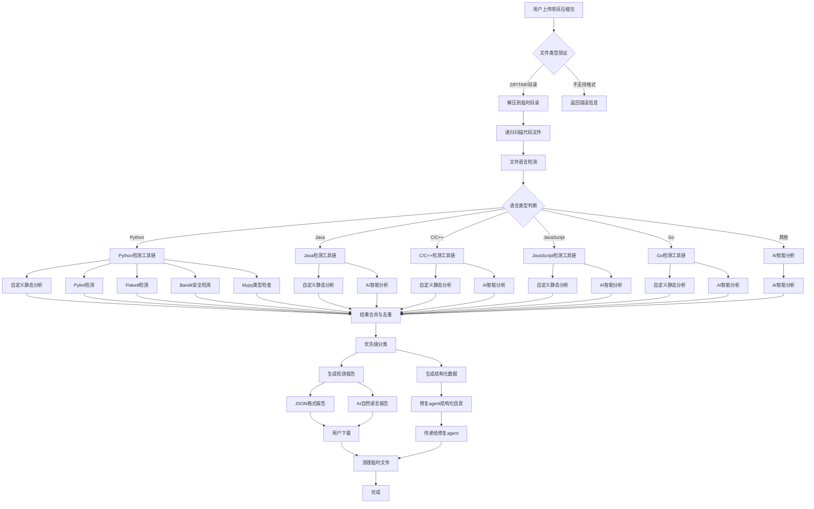
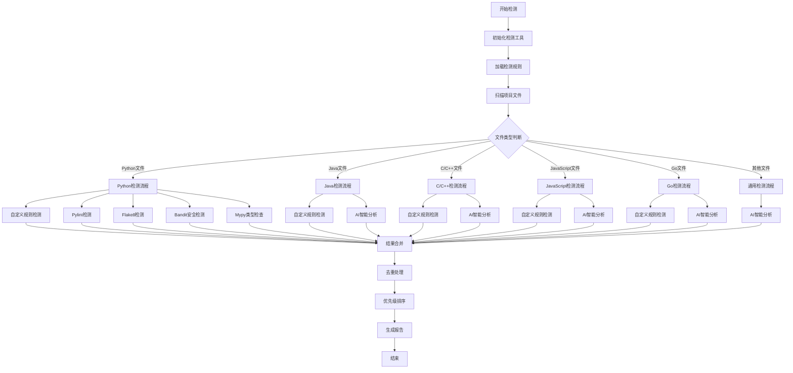
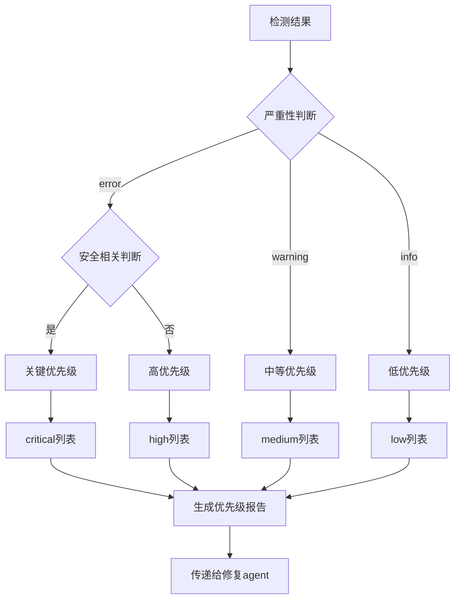
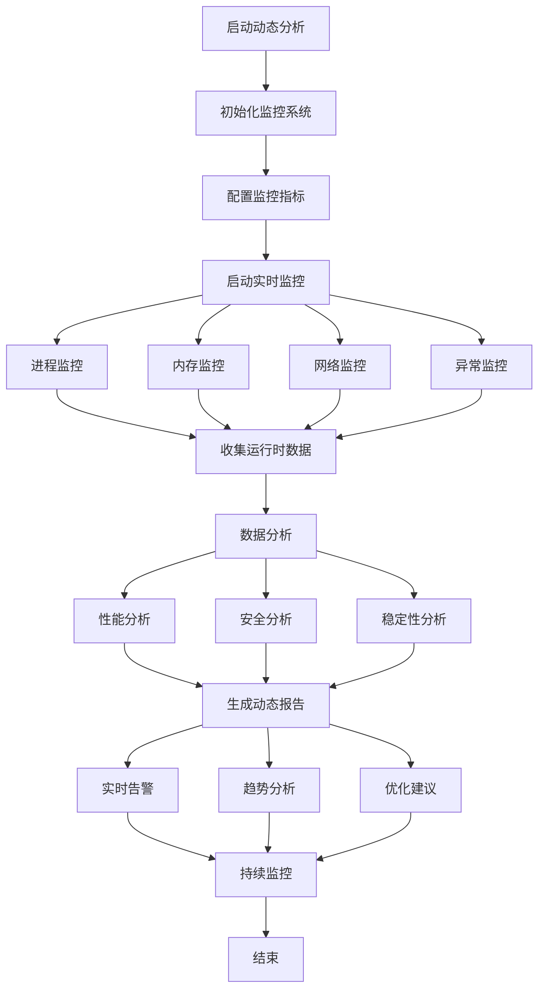
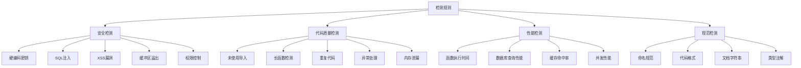
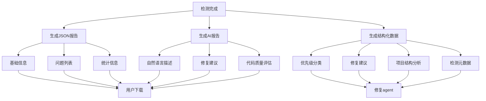

# Bug Detection Agent 流程图

## 主要流程图

```mermaid
graph TD
    A[用户上传项目压缩包] --> B{文件类型验证}
    B -->|ZIP/TAR/目录| C[解压到临时目录]
    B -->|不支持格式| Z[返回错误信息]
    
    C --> D[递归扫描代码文件]
    D --> E[文件语言检测]
    E --> F{语言类型判断}
    
    F -->|Python| G[Python检测工具链]
    F -->|Java| H[Java检测工具链]
    F -->|C/C++| I[C/C++检测工具链]
    F -->|JavaScript| J[JavaScript检测工具链]
    F -->|Go| K[Go检测工具链]
    F -->|其他| L[AI智能分析]
    
    G --> G1[自定义静态分析]
    G --> G2[Pylint检测]
    G --> G3[Flake8检测]
    G --> G4[Bandit安全检测]
    G --> G5[Mypy类型检查]
    
    H --> H1[自定义静态分析]
    H --> H2[AI智能分析]
    
    I --> I1[自定义静态分析]
    I --> I2[AI智能分析]
    
    J --> J1[自定义静态分析]
    J --> J2[AI智能分析]
    
    K --> K1[自定义静态分析]
    K --> K2[AI智能分析]
    
    L --> L1[AI智能分析]
    
    G1 --> M[结果合并与去重]
    G2 --> M
    G3 --> M
    G4 --> M
    G5 --> M
    H1 --> M
    H2 --> M
    I1 --> M
    I2 --> M
    J1 --> M
    J2 --> M
    K1 --> M
    K2 --> M
    L1 --> M
    
    M --> N[优先级分类]
    N --> O[生成检测报告]
    N --> P[生成结构化数据]
    
    O --> O1[JSON格式报告]
    O --> O2[AI自然语言报告]
    P --> P1[修复agent结构化信息]
    
    O1 --> Q[用户下载]
    O2 --> Q
    P1 --> R[传递给修复agent]
    
    Q --> S[清理临时文件]
    R --> S
    S --> T[完成]
```

## 详细检测流程

```mermaid
graph TD
    A[开始检测] --> B[初始化检测工具]
    B --> C[加载检测规则]
    C --> D[扫描项目文件]
    D --> E{文件类型判断}
    
    E -->|Python文件| F[Python检测流程]
    E -->|Java文件| G[Java检测流程]
    E -->|C/C++文件| H[C/C++检测流程]
    E -->|JavaScript文件| I[JavaScript检测流程]
    E -->|Go文件| J[Go检测流程]
    E -->|其他文件| K[通用检测流程]
    
    F --> F1[自定义规则检测]
    F --> F2[Pylint检测]
    F --> F3[Flake8检测]
    F --> F4[Bandit安全检测]
    F --> F5[Mypy类型检查]
    
    G --> G1[自定义规则检测]
    G --> G2[AI智能分析]
    
    H --> H1[自定义规则检测]
    H --> H2[AI智能分析]
    
    I --> I1[自定义规则检测]
    I --> I2[AI智能分析]
    
    J --> J1[自定义规则检测]
    J --> J2[AI智能分析]
    
    K --> K1[AI智能分析]
    
    F1 --> L[结果合并]
    F2 --> L
    F3 --> L
    F4 --> L
    F5 --> L
    G1 --> L
    G2 --> L
    H1 --> L
    H2 --> L
    I1 --> L
    I2 --> L
    J1 --> L
    J2 --> L
    K1 --> L
    
    L --> M[去重处理]
    M --> N[优先级排序]
    N --> O[生成报告]
    O --> P[结束]
```

## 优先级分类流程

```mermaid
graph TD
    A[检测结果] --> B{严重性判断}
    B -->|error| C{安全相关判断}
    B -->|warning| D[中等优先级]
    B -->|info| E[低优先级]
    
    C -->|是| F[关键优先级]
    C -->|否| G[高优先级]
    
    F --> H[critical列表]
    G --> I[high列表]
    D --> J[medium列表]
    E --> K[low列表]
    
    H --> L[生成优先级报告]
    I --> L
    J --> L
    K --> L
    
    L --> M[传递给修复agent]
```

## 动态分析流程图

```mermaid
graph TD
    A[启动动态分析] --> B[初始化监控系统]
    B --> C[配置监控指标]
    C --> D[启动实时监控]
    
    D --> E[进程监控]
    D --> F[内存监控]
    D --> G[网络监控]
    D --> H[异常监控]
    
    E --> I[收集运行时数据]
    F --> I
    G --> I
    H --> I
    
    I --> J[数据分析]
    J --> K[性能分析]
    J --> L[安全分析]
    J --> M[稳定性分析]
    
    K --> N[生成动态报告]
    L --> N
    M --> N
    
    N --> O[实时告警]
    N --> P[趋势分析]
    N --> Q[优化建议]
    
    O --> R[持续监控]
    P --> R
    Q --> R
    R --> S[结束]
```

## 检测规则分类

```mermaid
graph TD
    A[检测规则] --> B[安全检测]
    A --> C[代码质量检测]
    A --> D[性能检测]
    A --> E[规范检测]
    
    B --> B1[硬编码密钥]
    B --> B2[SQL注入]
    B --> B3[XSS漏洞]
    B --> B4[缓冲区溢出]
    B --> B5[权限控制]
    
    C --> C1[未使用导入]
    C --> C2[长函数检测]
    C --> C3[重复代码]
    C --> C4[异常处理]
    C --> C5[内存泄漏]
    
    D --> D1[函数执行时间]
    D --> D2[数据库查询性能]
    D --> D3[缓存命中率]
    D --> D4[并发性能]
    
    E --> E1[命名规范]
    E --> E2[代码格式]
    E --> E3[文档字符串]
    E --> E4[类型注解]
```

## 输出格式流程

```mermaid
graph TD
    A[检测完成] --> B[生成JSON报告]
    A --> C[生成AI报告]
    A --> D[生成结构化数据]
    
    B --> B1[基础信息]
    B --> B2[问题列表]
    B --> B3[统计信息]
    
    C --> C1[自然语言描述]
    C --> C2[修复建议]
    C --> C3[代码质量评估]
    
    D --> D1[优先级分类]
    D --> D2[修复建议]
    D --> D3[项目结构分析]
    D --> D4[检测元数据]
    
    B1 --> E[用户下载]
    B2 --> E
    B3 --> E
    C1 --> E
    C2 --> E
    C3 --> E
    D1 --> F[修复agent]
    D2 --> F
    D3 --> F
    D4 --> F
```

这个流程图展示了Bug Detection Agent的完整工作流程，从文件上传到最终输出，包括静态检测、动态分析、优先级分类等各个关键环节。
