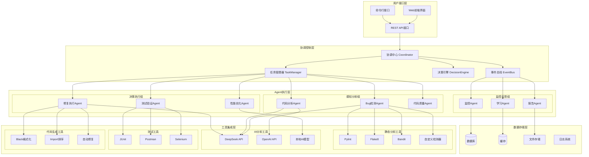

# AI Agent 系统架构设计

## 系统整体架构图

## 核心组件说明

### 1. 协调控制层
- **协调中心 (Coordinator)**: 系统核心，负责整体工作流协调
- **任务管理器 (TaskManager)**: 任务调度、分配和状态管理
- **决策引擎 (DecisionEngine)**: 智能决策，决定修复策略
- **事件总线 (EventBus)**: Agent间通信和事件分发

### 2. Agent执行层
#### 感知分析组
- **Bug检测Agent**: 多语言缺陷检测，保留现有功能
- **代码分析Agent**: 项目结构分析和依赖关系理解
- **代码质量Agent**: 代码规范和质量评估

#### 决策执行组
- **修复执行Agent**: 自动修复代码问题
- **测试验证Agent**: 验证修复效果
- **性能优化Agent**: 性能监控和优化建议

#### 监控反馈组
- **监控Agent**: 系统状态监控
- **报告Agent**: 生成各类报告
- **学习Agent**: 从历史数据中学习优化

### 3. 工具集成层
- **静态分析工具**: 传统代码分析工具
- **AI分析工具**: 大语言模型集成
- **测试工具**: 自动化测试框架
- **代码生成工具**: 代码格式化和修复工具

## 工作流设计原则

1. **模块化设计**: 每个Agent职责单一，便于维护和扩展
2. **异步处理**: 支持并发执行，提高系统效率
3. **智能决策**: 基于AI的决策引擎，自动选择最佳处理策略
4. **反馈循环**: 持续学习和优化
5. **可扩展性**: 易于添加新的Agent和工具
