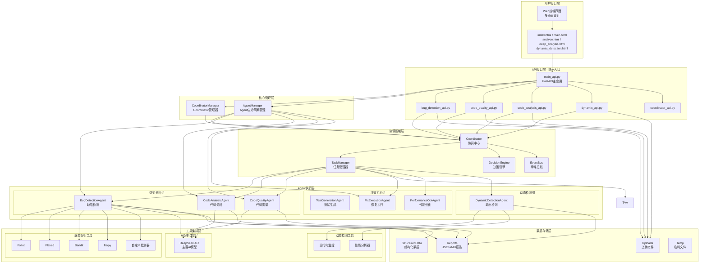

# AI Agent 系统架构设计

## 系统整体架构图



## 核心组件说明

### 1. 用户接口层
- **Web前端界面**: 多页面设计，提供不同功能入口
  - `index.html` / `login.html`: 登录页面
  - `main.html`: 主界面导航
  - `analyse.html`: 静态分析界面
  - `deep_analysis.html`: 深度分析界面
  - `dynamic_detection.html`: 动态检测界面
  - `explore.html`: 探索功能
  - `projects.html`: 项目管理

### 2. API接口层（统一入口）
- **main_api.py**: FastAPI主应用，系统唯一启动点
  - 管理 CoordinatorManager 和 AgentManager
  - 挂载所有子路由模块
  - 提供健康检查和根路径
- **5个子API模块**（使用 APIRouter）:
  - `bug_detection_api.py`: 缺陷检测服务
  - `code_quality_api.py`: 代码质量分析
  - `code_analysis_api.py`: 代码深度分析
  - `dynamic_api.py`: 动态检测服务
  - `coordinator_api.py`: Coordinator管理接口

### 3. 核心管理层
- **CoordinatorManager**: 管理 Coordinator 的生命周期
  - 启动/停止 Coordinator
  - 提供 Coordinator 实例访问
- **AgentManager**: 管理所有 Agent 的生命周期
  - 启动所有 Agent（BugDetection, FixExecution, CodeAnalysis, CodeQuality）
  - 注册 Agent 到 Coordinator
  - 提供 Agent 访问接口

### 4. 协调控制层
- **Coordinator**: 系统核心，负责整体工作流协调
  - 接收 API 请求并分发任务
  - 协调多个 Agent 协作
  - 管理任务生命周期
- **TaskManager**: 任务调度、分配和状态管理
  - 创建和跟踪任务
  - 设置任务优先级
  - 监控任务状态
- **DecisionEngine**: 智能决策引擎
  - 分析缺陷复杂度
  - 选择修复策略
  - 评估风险
- **EventBus**: Agent间通信和事件分发
  - 发布-订阅模式
  - 异步消息传递
  - 解耦Agent通信

### 5. Agent执行层
#### 感知分析组
- **BugDetectionAgent**: 多语言缺陷检测
  - Python: Pylint + Flake8 + Bandit + Mypy + 自定义检测器
  - 其他语言: AI智能分析
  - 生成 JSON 和 Markdown 报告
- **CodeAnalysisAgent**: 项目结构分析
  - 代码结构分析
  - 依赖关系分析
  - 架构模式识别
- **CodeQualityAgent**: 代码质量评估
  - 代码质量评分
  - 复杂度分析
  - 风格检查

#### 决策执行组
- **FixExecutionAgent**: 自动修复代码问题
  - 简单缺陷自动修复
  - AI辅助修复方案生成
  - 修复回滚机制
- **TestGenerationAgent**: 生成tests文件夹，建立测试基线
  - 语言检测（Python, Java, C/C++）
  - 测试文件夹检查
  - 重现测试生成
  - 覆盖性测试生成（LLM + 工具）
- **PerformanceOptimizationAgent**: 性能优化
  - 性能监控
  - 瓶颈识别
  - 优化建议

#### 动态检测组（新增）
- **DynamicDetectionAgent**: 运行时行为分析
  - 运行项目并监控
  - 性能指标收集
  - 运行时错误检测

### 6. 工具集成层
- **静态分析工具**: Pylint, Flake8, Bandit, Mypy, 自定义检测器
- **AI分析工具**: DeepSeek API（主要AI模型）
- **动态检测工具**: 运行时监控、性能分析器

### 7. 数据存储层
- **Reports**: JSON和Markdown格式的检测报告
- **StructuredData**: 结构化数据导出（用于进一步分析）
- **Uploads**: 用户上传的文件和项目
- **Temp**: 临时文件和解压目录

## 实际工作流程

### 启动顺序（重要！）
```
1. start_api.py 启动
   ↓
2. main_api.py startup_event 触发
   ↓
3. 创建 CoordinatorManager
   ├─ 启动 Coordinator
   ├─ 启动 TaskManager
   ├─ 启动 EventBus
   └─ 启动 DecisionEngine
   ↓
4. 创建 AgentManager(coordinator)
   ├─ 创建 BugDetectionAgent
   ├─ 创建 FixExecutionAgent
   ├─ 创建 CodeAnalysisAgent
   ├─ 创建 CodeQualityAgent
   └─ 注册所有 Agent 到 Coordinator
   ↓
5. 挂载 API 路由模块
   ├─ coordinator_api.router
   ├─ code_quality_api.router
   ├─ code_analysis_api.router
   ├─ bug_detection_api.router
   └─ dynamic_api.router
   ↓
6. 系统启动完成，监听 0.0.0.0:8001
```

### 用户请求处理流程
```
用户前端请求
   ↓
API 路由分发（main_api.py）
   ├─ /api/v1/detection/* → bug_detection_api
   ├─ /api/code-quality/* → code_quality_api
   ├─ /api/code-analysis/* → code_analysis_api
   ├─ /api/dynamic/* → dynamic_api
   └─ /api/v1/coordinator/* → coordinator_api
   ↓
各 API 模块处理请求
   ↓
通过 Coordinator 创建任务
   ↓
TaskManager 分配给相应 Agent
   ↓
Agent 执行任务
   ├─ 调用静态分析工具
   ├─ 调用 AI 分析
   └─ 生成报告
   ↓
结果返回给 Coordinator
   ↓
通过 API 返回给前端
   ↓
前端展示结果
```

## 工作流设计原则

1. **Coordinator 优先**: 先启动 Coordinator，再启动 Agent（确保协调中心就绪）
2. **模块化设计**: 每个Agent职责单一，API模块独立，便于维护和扩展
3. **统一入口**: main_api.py 作为唯一启动点，管理所有组件
4. **异步处理**: 支持并发执行，提高系统效率
5. **智能决策**: 基于AI的决策引擎，自动选择最佳处理策略
6. **三种分析模式**: file（单文件）、project（项目）、dynamic（动态检测）
7. **可扩展性**: 易于添加新的Agent和工具
