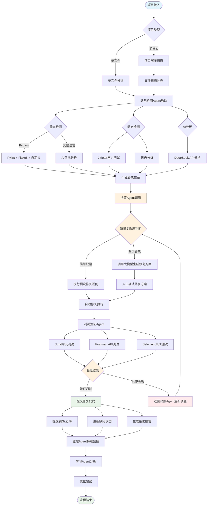
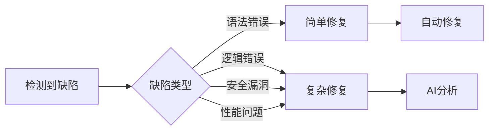
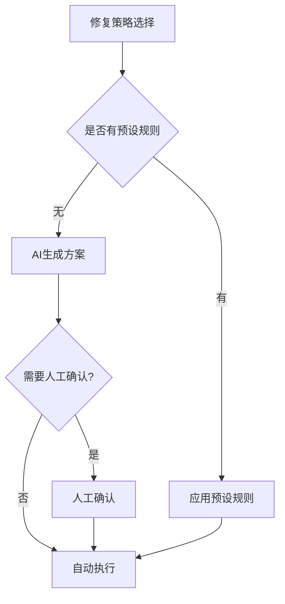
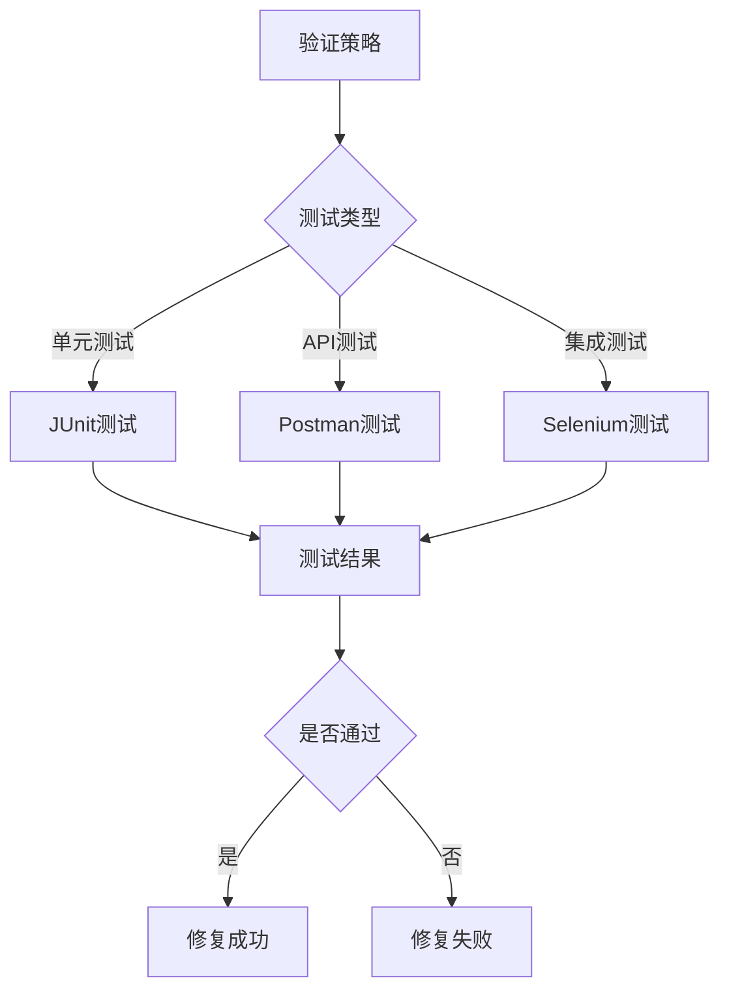

# AI Agent 工作流程图

## 完整工作流程图

## 详细工作流说明

### 阶段1: 项目接入与预处理
1. **项目接入**: 支持单文件和项目包上传
2. **文件扫描**: 自动识别编程语言和文件类型
3. **预处理**: 解压、分类、过滤大文件

### 阶段2: 多维度缺陷检测
1. **静态检测**: 
   - Python: Pylint + Flake8 + 自定义检测器
   - 其他语言: AI智能分析
2. **动态检测**: JMeter压力测试 + 日志分析
3. **AI分析**: DeepSeek API深度分析

### 阶段3: 智能决策与修复
1. **缺陷分类**: 按复杂度和类型分类
2. **修复策略选择**:
   - 简单缺陷: 自动执行预设规则
   - 复杂缺陷: AI生成方案 + 人工确认
3. **修复执行**: 自动应用修复方案

### 阶段4: 验证与反馈
1. **多维度验证**:
   - 单元测试 (JUnit)
   - API测试 (Postman)
   - 集成测试 (Selenium)
2. **结果处理**:
   - 验证通过: 提交代码，更新状态
   - 验证失败: 返回重新调整

### 阶段5: 持续监控与学习
1. **监控**: 持续监控系统状态
2. **学习**: 从历史数据中学习优化
3. **报告**: 生成量化分析报告

## 关键决策点

### 1. 缺陷复杂度判断

### 2. 修复策略选择

### 3. 验证策略

## 错误处理与重试机制

### 1. 检测失败处理
- 工具不可用: 自动切换到备用工具
- AI分析失败: 降级到传统分析
- 网络超时: 自动重试机制

### 2. 修复失败处理
- 自动修复失败: 回滚到原始状态
- 验证失败: 返回决策引擎重新分析
- 多次失败: 标记为需要人工干预

### 3. 系统异常处理
- Agent崩溃: 自动重启和任务转移
- 资源不足: 动态调整并发数
- 存储空间: 自动清理临时文件
