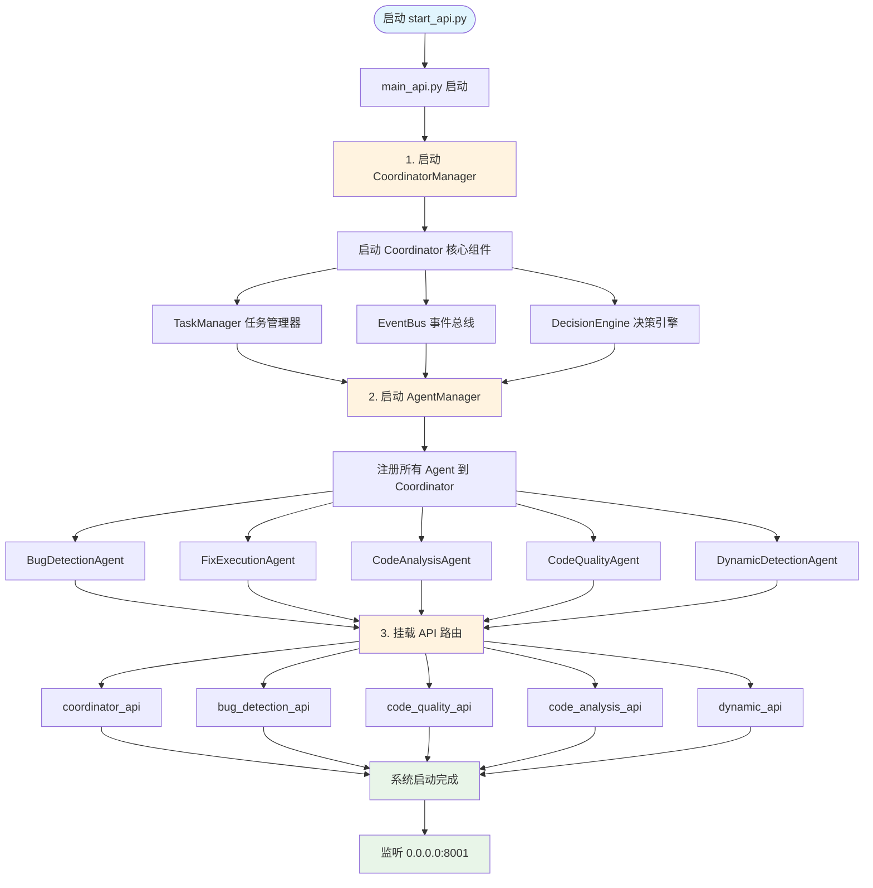
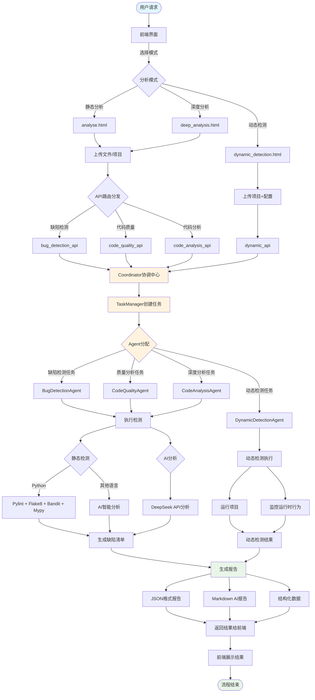
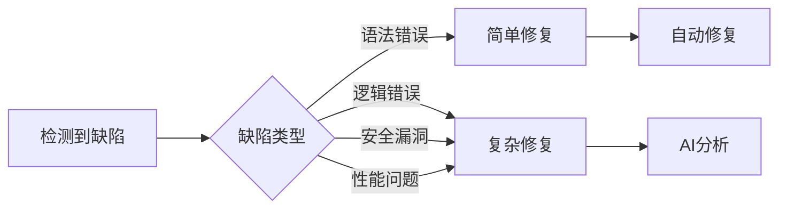
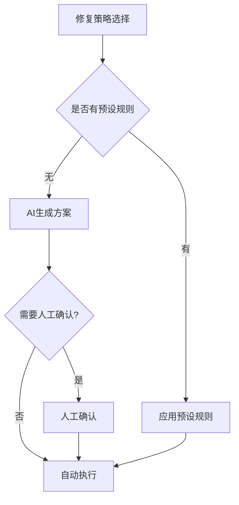
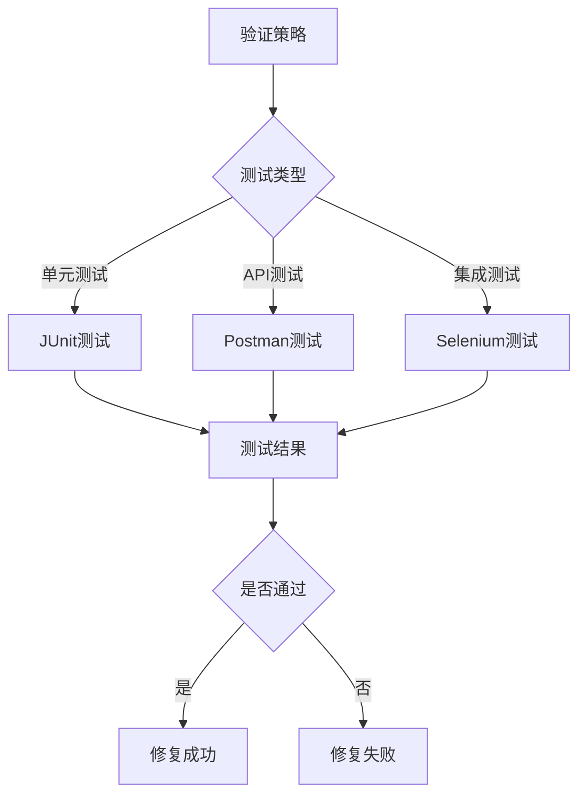

# AI Agent 工作流程图

## 系统启动流程图

## 完整工作流程图（用户请求处理）

## 详细工作流说明

### 阶段1: 系统启动（Coordinator 优先）
1. **启动 CoordinatorManager**:
   - 初始化 Coordinator（协调中心）
   - 启动 TaskManager（任务管理器）
   - 启动 EventBus（事件总线）
   - 启动 DecisionEngine（决策引擎）
2. **启动 AgentManager**:
   - 创建并启动所有 Agent
   - 将 Agent 注册到 Coordinator
3. **挂载 API 路由**:
   - coordinator_api（任务状态、Agent 管理）
   - bug_detection_api（缺陷检测）
   - code_quality_api（代码质量分析）
   - code_analysis_api（代码深度分析）
   - dynamic_api（动态检测）

### 阶段2: 用户请求处理
1. **前端选择分析模式**:
   - 静态分析（analyse.html）
   - 深度分析（deep_analysis.html）
   - 动态检测（dynamic_detection.html）
2. **上传文件/项目**: 支持单文件、压缩包、项目目录
3. **API 路由分发**: 根据分析类型路由到相应的 API 模块

### 阶段3: Coordinator 任务协调
1. **接收 API 请求**: 各 API 模块将请求转发给 Coordinator
2. **TaskManager 创建任务**: 
   - 生成唯一 task_id
   - 设置任务类型和优先级
   - 存储任务状态
3. **Agent 分配**: 根据任务类型分配给相应的 Agent

### 阶段4: Agent 执行任务
1. **BugDetectionAgent** (缺陷检测):
   - Python: Pylint + Flake8 + Bandit + Mypy + 自定义检测器
   - 其他语言: AI智能分析
   - 生成缺陷清单和 AI 报告
2. **CodeQualityAgent** (代码质量):
   - 代码质量评分
   - 复杂度分析
   - 风格检查
3. **CodeAnalysisAgent** (深度分析):
   - 代码结构分析
   - 依赖关系分析
   - 架构模式识别
4. **DynamicDetectionAgent** (动态检测):
   - 运行项目
   - 监控运行时行为
   - 分析性能指标

### 阶段5: 结果生成与返回
1. **生成多格式报告**:
   - JSON 格式（完整检测结果）
   - Markdown AI 报告（自然语言分析）
   - 结构化数据（用于进一步分析）
2. **返回结果**: 
   - 通过 Coordinator 返回给 API
   - API 返回给前端
3. **前端展示**: 
   - 可视化展示检测结果
   - 提供下载选项

## 关键决策点

### 1. 缺陷复杂度判断

### 2. 修复策略选择

### 3. 验证策略

## 错误处理与重试机制

### 1. 检测失败处理
- 工具不可用: 自动切换到备用工具
- AI分析失败: 降级到传统分析
- 网络超时: 自动重试机制

### 2. 修复失败处理
- 自动修复失败: 回滚到原始状态
- 验证失败: 返回决策引擎重新分析
- 多次失败: 标记为需要人工干预

### 3. 系统异常处理
- Agent崩溃: 自动重启和任务转移
- 资源不足: 动态调整并发数
- 存储空间: 自动清理临时文件
