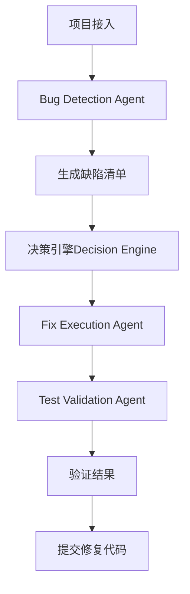
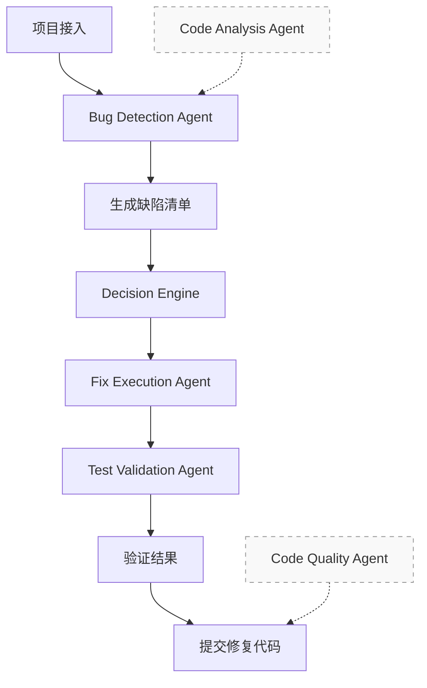

# Agent详细说明文档

## 📋 概述

本文档详细说明了AI Agent系统中需要实现的Agent：它们的职责、区别、交互方式以及与协调中心的集成机制。

## 🔄 工作流程理解

根据`workflow_diagram.md`，主工作流程是：



## 🤖 Agent分类和职责

### 🎯 主流程Agent

这些Agent是主工作流程的核心步骤：

#### 1. **Bug Detection Agent (缺陷检测Agent)** ✅ 已实现

**在流程中的位置**：主工作流程的第1步
**主要职责**：
- 检测代码中的各种缺陷和问题
- 支持多语言静态分析
- 生成详细的缺陷报告

**核心功能**：
```python
# 检测能力
- 语法错误和编译问题
- 逻辑错误和算法问题  
- 内存泄漏和资源管理问题
- 安全漏洞和输入验证问题
- 性能问题和优化建议
- 代码规范和最佳实践问题

# 支持语言
- Python (完整支持)
- Java, C/C++, JavaScript, Go (AI分析)
```

**输入输出**：
```python
输入: {
    "project_path": "/path/to/project",
    "options": {
        "enable_static": True,
        "enable_ai_analysis": True
    }
}

输出: {
    "total_issues": 15,
    "issues": [
        {
            "type": "unused_imports",
            "severity": "warning", 
            "line": 10,
            "message": "未使用的导入",
            "file": "main.py"
        }
    ],
    "summary": {...}
}
```

#### 2. **Fix Execution Agent (修复执行Agent)** ❌ 待实现

**在流程中的位置**：主工作流程的第3步（在Decision Engine之后）

**主要职责**：
- 接收结构化的缺陷结果和决策引擎的分析结果
- 执行具体的代码修复操作
- 支持自动修复和AI辅助修复

**核心功能**：
```python
# 修复能力
- 简单缺陷自动修复 (格式化、删除未使用导入等)
- AI辅助修复 (重构建议、命名优化等)
- 代码格式化工具集成
- 修复回滚机制
- 修复验证和测试
```

**输入输出**：
```python
输入: {
    "issues": [...],  # 来自Bug Detection Agent
    "decisions": {...},  # 来自Decision Engine
    "project_path": "/path/to/project",
    "fix_options": {
        "backup_enabled": True,
        "rollback_enabled": True,
        "auto_fix_enabled": True,
        "ai_assisted_enabled": True
    }
}

输出: {
    "fix_results": [
        {
            "issue_id": "issue_1",
            "fix_type": "auto_remove",
            "success": True,
            "changes": [...],
            "backup_path": "..."
        }
    ],
    "summary": {
        "total_fixed": 10,
        "auto_fixed": 7,
        "ai_assisted": 3
    }
}
```

#### 3. **Test Validation Agent (测试验证Agent)** ❌ 待实现

**在流程中的位置**：主工作流程的第4步（最后一步）

**主要职责**：
- 验证修复后的代码正确性
- 运行单元测试、API测试、集成测试
- 分析测试覆盖率
- 确保修复没有引入新问题

**核心功能**：
```python
# 验证能力
- 单元测试生成和执行
- API测试自动化 (Postman集成)
- 集成测试支持 (Selenium)
- 测试覆盖率分析
- 性能回归测试
- 修复验证报告
```

**输入输出**：
```python
输入: {
    "project_path": "/path/to/project",
    "fix_result": {...},  # 来自Fix Execution Agent
    "test_types": ["unit", "api", "integration"]
}

输出: {
    "test_results": {
        "unit_tests": {"passed": 95, "failed": 5, "coverage": 85},
        "api_tests": {"passed": 100, "failed": 0},
        "integration_tests": {"passed": 90, "failed": 10}
    },
    "validation_status": "passed",  # passed, failed, partial
    "regression_detected": False,
    "recommendations": [...]
}
```

#### 4. **Code Analysis Agent (代码分析Agent)** ❌ 待实现

**在流程中的位置**：辅助功能，被Bug Detection Agent调用
**主要职责**：
- 为Bug Detection Agent提供深度代码理解
- 分析项目结构和依赖关系
- 评估代码复杂度
- 识别架构模式

**集成方式**：
```python
# 在Bug Detection Agent内部调用
class BugDetectionAgent:
    async def _analyze_with_ai(self, file_path: str):
        # 调用Code Analysis Agent进行深度分析
        analysis_result = await self.code_analysis_agent.analyze_file(file_path)
        return analysis_result
```

#### 5. **Code Quality Agent (代码质量Agent)** ❌ 待实现

**在流程中的位置**：辅助功能，在最终报告生成时调用
**主要职责**：
- 为最终报告提供质量评估
- 生成质量评分报告
- 提供质量改进建议

**集成方式**：
```python
# 在工作流完成时调用
async def generate_final_report(self, workflow_result):
    # 调用Code Quality Agent进行质量评估
    quality_assessment = await self.code_quality_agent.assess_quality(
        project_path=workflow_result['project_path'],
        fix_results=workflow_result['fix_result']
    )
    return quality_assessment
```

## 🔄 协调中心如何接收Agent消息

### 消息接收机制


### 具体实现

```python
# 1. Agent发送消息
async def send_result_to_coordinator(self, task_id: str, result: Dict[str, Any], success: bool):
    await self.event_bus.send_result_message(
        source_agent=self.agent_id,
        target_agent="coordinator",
        task_id=task_id,
        result=result,
        success=success
    )

# 2. 协调中心接收消息
async def _handle_agent_result(self, agent_id: str, message):
    task_id = message.task_id
    result = message.result
    success = message.status.value == "completed"
    
    # 更新任务结果
    await self.task_manager.update_task_result(task_id, result, success)
    
    # 根据任务类型触发后续流程
    await self._process_task_completion(task_id, result)
```

## 🔧 动态Agent注册机制

### 什么是动态Agent注册？

动态Agent注册是指Agent可以在系统运行时**随时加入或离开**系统，而不需要重启整个系统。

```python
# 动态注册示例
async def register_new_agent():
    # 创建新的Agent实例
    new_agent = CodeAnalysisAgent(config)
    
    # 动态注册到协调中心
    await coordinator.register_agent("code_analysis_agent", new_agent)
    
    # Agent立即可以接收任务
    print("新Agent已注册并可以使用")
```

### 注册流程


### 注册代码实现

```python
async def register_agent(self, agent_id: str, agent):
    """注册Agent"""
    self.agents[agent_id] = agent
    
    # 设置消息处理函数
    agent_handler = lambda message: self._handle_agent_message(agent_id, message)
    await self.event_bus.subscribe("agent_message", agent_id, agent_handler)
    
    # 发布Agent注册事件
    await self.event_bus.publish(
        EventType.AGENT_STARTED.value,
        {"agent_id": agent_id, "capabilities": agent.get_capabilities()},
        "coordinator",
        broadcast=True
    )
```

## 📨 相同消息接口不会混淆的原因

### 消息路由机制

```python
# 每条消息都有明确的标识
class TaskMessage(BaseMessage):
    def __init__(self, ...):
        self.source_agent = "coordinator"      # 发送方
        self.target_agent = "bug_detection_agent"  # 接收方
        self.task_id = "task_123"              # 任务ID
        self.message_type = "task"             # 消息类型
```

### 消息不会混淆的原因

1. **明确的发送方和接收方**：
   ```python
   # 协调中心发送给Bug检测Agent
   message.target_agent = "bug_detection_agent"
   
   # Bug检测Agent回复给协调中心
   message.target_agent = "coordinator"
   ```

2. **唯一的任务ID**：
   ```python
   # 每个任务都有唯一ID，结果消息会携带相同的task_id
   task_id = "task_123"
   # 协调中心可以根据task_id匹配结果
   ```

3. **消息类型区分**：
   ```python
   # 不同类型的消息有不同的处理方式
   if message.message_type == "task":
       # 处理任务消息
   elif message.message_type == "result":
       # 处理结果消息
   ```

4. **Agent能力标识**：
   ```python
   # 每个Agent声明自己的能力
   def get_capabilities(self) -> List[str]:
       return ["bug_detection", "static_analysis", "multi_language"]
   ```

## 🔄 Bug Detection Agent修改对协调中心的影响

### 好消息：协调中心不需要修改！

你的协调中心设计具有**完全的解耦性**：

#### 1. **接口标准化**
```python
# 所有Agent都使用相同的接口
async def process_task(self, task_id: str, task_data: Dict[str, Any]) -> Dict[str, Any]:
    """标准接口，任何修改都不会影响协调中心"""
    pass
```

#### 2. **消息格式稳定**
```python
# 消息格式已经标准化，不会改变
{
    "message_type": "result",
    "task_id": "task_123", 
    "result": {...},  # 具体内容可能变化，但结构稳定
    "status": "completed"
}
```

#### 3. **配置驱动**
```python
# 通过配置文件控制Agent行为
AGENTS = {
    "bug_detection_agent": {
        "enabled": True,
        "max_workers": 2,
        "new_feature": True  # 新功能通过配置启用
    }
}
```

### 可能的修改场景

#### 场景1：添加新的检测类型
```python
# Bug Detection Agent新增检测类型
new_issue_types = ["new_security_issue", "performance_bottleneck"]

# 协调中心自动支持，无需修改
# 决策引擎会自动处理新类型
decisions = await decision_engine.analyze_complexity(issues_with_new_types)
```

#### 场景2：修改输出格式
```python
# 如果输出格式有微小变化
old_format = {"total_issues": 10, "issues": [...]}
new_format = {"total_issues": 10, "issues": [...], "metadata": {...}}

# 协调中心仍然可以处理，因为核心字段不变
total_issues = result.get("total_issues", 0)  # 兼容新旧格式
```

#### 场景3：添加新的配置选项
```python
# 新配置选项
new_options = {
    "enable_dynamic_analysis": True,
    "custom_rules": [...]
}

# 协调中心自动传递配置
task_data = {
    "project_path": project_path,
    "options": new_options  # 直接传递，无需修改
}
```

## 🎯 总结

### Agent协作关系



**说明**：
- **实线箭头**：主工作流程，必须按顺序执行
- **虚线箭头**：辅助功能，为其他Agent提供支持

### 协调中心的优势

1. **严格遵循工作流程** - 按照组长规定的正确流程执行
2. **主流程优先** - 专注于核心的4个主流程步骤
3. **辅助功能解耦** - 辅助Agent不影响主工作流程
4. **标准化接口** - 所有Agent使用统一接口
5. **智能路由** - 自动将消息路由给正确的Agent
6. **健壮性** - 完善的错误处理和重试机制

### 实现建议

1. **优先实现主流程Agent**：
   - Bug Detection Agent（已实现）
   - Fix Execution Agent
   - Test Validation Agent

2. **辅助功能Agent**：
   - Code Analysis Agent（集成到Bug Detection Agent中）
   - Code Quality Agent（集成到最终报告生成中）

3. **保持接口稳定** - 确保所有Agent都实现标准接口
4. **充分测试** - 每个Agent都要与协调中心集成测试
