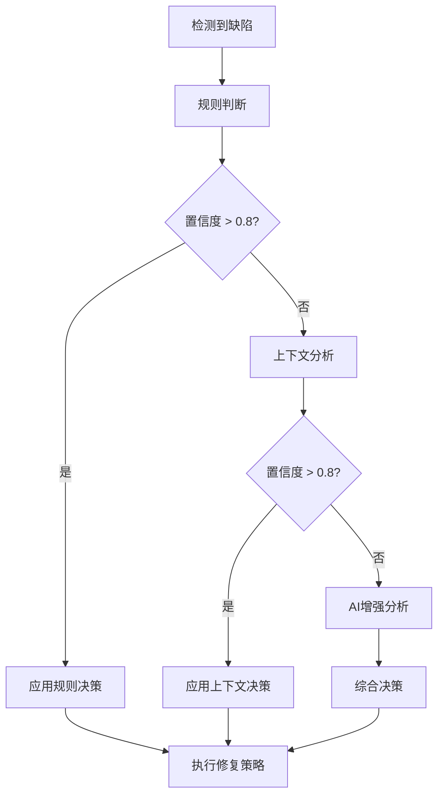

# 缺陷检测和分类说明文档

## 概述

本文档详细说明了AI Agent系统中缺陷检测Agent的检测能力、缺陷分类体系、决策机制以及与协调中心的集成方式。

## 当前缺陷检测能力

### 支持的语言

- **Python**: 完整支持，使用Pylint + Flake8 + 自定义检测器 + AI分析
- **Java**: AI分析检测空指针、内存泄漏等问题
- **C/C++**: AI分析检测缓冲区溢出、内存泄漏等问题
- **JavaScript/TypeScript**: AI分析检测XSS、内存泄漏等问题
- **Go**: AI分析检测并发安全、错误处理等问题

### 检测工具链

1. **静态分析工具**: Pylint, Flake8, Bandit
2. **AI分析工具**: DeepSeek API
3. **自定义检测器**: 针对特定问题的检测规则

## 缺陷分类体系

### 分类原则

缺陷按照**复杂度**和**修复难度**分为三个层次：

1. **简单缺陷** - 可以直接自动修复
2. **中等缺陷** - 需要AI辅助修复
3. **复杂缺陷** - 需要人工审查

### 详细分类表

#### 简单缺陷 (可直接自动修复)

| 缺陷类型               | 中文名称       | 检测规则               | 自动修复策略      | 示例                    |
| ---------------------- | -------------- | ---------------------- | ----------------- | ----------------------- |
| `unused_imports`     | 未使用的导入   | 检测导入但未使用的模块 | `auto_remove`   | `import os  # 未使用` |
| `bad_formatting`     | 代码格式问题   | 检测缩进和格式问题     | `auto_format`   | 缩进不一致              |
| `unused_variables`   | 未使用的变量   | 检测定义但未使用的变量 | `auto_remove`   | `x = 1  # 未使用`     |
| `missing_docstrings` | 缺少文档字符串 | 检测函数和类缺少文档   | `auto_generate` | 函数无docstring         |

**特点**:

- 修复风险低 (< 0.1)
- 修复时间短 (< 1秒)
- 不需要理解业务逻辑
- 修复结果可预测

#### 中等缺陷 (需要AI辅助修复)

| 缺陷类型           | 中文名称   | 检测规则                   | AI修复策略                | 示例             |
| ------------------ | ---------- | -------------------------- | ------------------------- | ---------------- |
| `magic_numbers`  | 魔法数字   | 检测硬编码的数字常量       | `ai_suggest_constants`  | `if age > 18:` |
| `bad_naming`     | 命名不规范 | 检测不符合命名规范的标识符 | `ai_rename_suggestions` | `def calc()`   |
| `long_functions` | 过长的函数 | 检测超过50行的函数         | `ai_refactor`           | 100行的函数      |
| `deep_nesting`   | 过深的嵌套 | 检测超过4层的代码嵌套      | `ai_refactor`           | 5层if嵌套        |

**特点**:

- 修复风险中等 (0.1-0.3)
- 需要理解代码上下文
- 可能需要重构代码结构
- 修复结果需要验证

#### 复杂缺陷 (需要人工审查)

| 缺陷类型                     | 中文名称         | 检测规则                       | 处理策略                 | 示例                    |
| ---------------------------- | ---------------- | ------------------------------ | ------------------------ | ----------------------- |
| `hardcoded_secrets`        | 硬编码秘密信息   | 检测硬编码的密码、API密钥等    | `manual_review`        | `password = "123456"` |
| `unsafe_eval`              | 不安全的eval使用 | 检测使用eval函数的安全风险     | `manual_review`        | `eval(user_input)`    |
| `memory_leaks`             | 内存泄漏风险     | 检测可能的内存泄漏             | `ai_analysis_required` | 未关闭文件句柄          |
| `unsafe_file_operations`   | 不安全的文件操作 | 检测硬编码的文件路径           | `manual_review`        | `open("/etc/passwd")` |
| `missing_input_validation` | 缺少输入验证     | 检测用户输入处理缺少验证       | `ai_analysis_required` | 直接使用用户输入        |
| `insecure_random`          | 不安全的随机数   | 检测使用不安全的随机数生成     | `manual_review`        | `random.randint()`    |
| `duplicate_code`           | 重复代码         | 检测相似的代码块               | `ai_analysis_required` | 重复的业务逻辑          |
| `bad_exception_handling`   | 异常处理不当     | 检测裸露的except语句           | `ai_analysis_required` | `except: pass`        |
| `global_variables`         | 全局变量使用     | 检测全局变量的使用             | `ai_analysis_required` | 修改全局状态            |
| `unhandled_exceptions`     | 未处理的异常     | 检测可能抛出异常但未处理的代码 | `ai_analysis_required` | 可能失败的操作          |

**特点**:

- 修复风险高 (> 0.3)
- 涉及安全、性能、业务逻辑
- 需要深度理解代码意图
- 修复可能影响系统稳定性

## 决策引擎机制

### 决策流程



### 决策算法

1. **规则驱动决策** (优先级最高)

   - 基于预定义规则快速判断
   - 置信度: 0.9
   - 响应时间: < 10ms
2. **上下文增强决策** (中等优先级)

   - 分析文件类型、代码位置、消息内容
   - 置信度: 0.4-0.8
   - 响应时间: < 100ms
3. **AI增强决策** (最低优先级)

   - 调用DeepSeek API进行深度分析
   - 置信度: 0.3-0.7
   - 响应时间: 1-5秒

### 风险评估模型

```python
风险分数 = (修复类型风险 + 文件重要性风险 + 修改范围风险) / 3

修复类型风险:
- 自动修复: 0.1
- AI辅助: 0.3  
- 人工审查: 0.5

文件重要性风险:
- 测试文件: 0.1
- 普通文件: 0.2
- 核心文件: 0.4

修改范围风险:
- 单行修改: 0.1
- 多行修改(5-10行): 0.2
- 大范围修改(>10行): 0.3
```

## 工作流程集成

### 与协调中心的交互

1. **任务接收**

   ```python
   # 接收检测任务
   task_data = {
       "project_path": "/path/to/project",
       "options": {
           "enable_static": True,
           "enable_ai_analysis": True
       }
   }
   ```
2. **缺陷检测**

   ```python
   # 执行检测并返回结果
   detection_result = {
       "total_issues": 15,
       "issues": [...],
       "summary": {
           "error_count": 3,
           "warning_count": 8,
           "info_count": 4
       }
   }
   ```
3. **决策分析**

   ```python
   # 协调中心调用决策引擎
   decisions = await decision_engine.analyze_complexity(issues)
   # 返回: {
   #     "auto_fixable": [...],
   #     "ai_assisted": [...], 
   #     "manual_review": [...]
   # }
   ```
4. **修复执行**

   ```python
   # 根据决策结果执行修复
   fix_result = {
       "fix_results": [...],
       "success": True,
       "summary": {
           "auto_fixed": 5,
           "ai_assisted": 3,
           "manual_review_needed": 2
       }
   }
   ```

## 统计信息

### 检测统计

- **总缺陷数**: 按项目统计
- **分类统计**: 按复杂度分类
- **语言统计**: 按编程语言分类
- **工具统计**: 按检测工具分类

### 修复统计

- **修复成功率**: 按策略统计
- **修复时间**: 按复杂度统计
- **风险评估**: 按风险等级统计

### 性能指标

- **检测速度**: 文件/秒
- **AI分析时间**: 平均响应时间
- **决策时间**: 平均决策耗时
- **修复时间**: 平均修复耗时

## 配置选项

### 检测配置

```python
detection_config = {
    "enable_static": True,        # 启用静态检测
    "enable_pylint": True,        # 启用Pylint
    "enable_flake8": True,        # 启用Flake8
    "enable_ai_analysis": True,   # 启用AI分析
    "max_file_size": 10485760,    # 最大文件大小(10MB)
    "max_files_per_project": 1000 # 最大文件数量
}
```

### 决策配置

```python
decision_config = {
    "confidence_threshold": 0.8,  # 置信度阈值
    "ai_model": "deepseek",       # AI模型
    "max_retry_attempts": 3,      # 最大重试次数
    "timeout": 30                 # 超时时间(秒)
}
```

### 修复配置

```python
fix_config = {
    "auto_fix_enabled": True,     # 启用自动修复
    "ai_assisted_enabled": True,  # 启用AI辅助
    "manual_review_required": True, # 需要人工审查
    "backup_enabled": True,       # 启用备份
    "rollback_enabled": True      # 启用回滚
}
```

## 扩展性设计

### 新增缺陷类型

1. 在 `DEFECT_TYPES`中添加新类型
2. 在 `FIX_STRATEGIES`中定义修复策略
3. 在决策引擎中添加处理逻辑
4. 更新检测规则和描述

### 新增检测工具

1. 实现检测工具接口
2. 在Bug检测Agent中集成
3. 配置检测选项
4. 添加结果解析逻辑

### 新增修复策略

1. 定义新的修复策略
2. 实现修复逻辑
3. 添加风险评估
4. 更新决策引擎

## 总结

当前的缺陷检测和分类系统已经具备了：

1. **完整的检测能力** - 支持5种主流编程语言
2. **科学的分类体系** - 按复杂度三级分类
3. **智能的决策机制** - 规则+上下文+AI三重决策
4. **灵活的工作流程** - 与协调中心无缝集成
5. **强大的扩展性** - 易于添加新类型和策略
